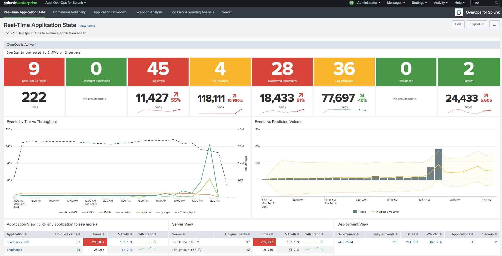

# OverOps-for-Splunk
OverOps for Splunk application

Installation procedure for the Splunk app:

From within the OverOps user interface:

1. Turn statsd on from publish metrics. (Settings -> Publish Metrics)

2. Define the statsD server address as `<splunk-server-name-here>:8125`
(this reflects a Splunk UDP data input on port 8125)

3. The OverOps metrics should be defined as the following:

`overops_views,${viewname},${serviceid},${application},${server},${deployment}`

`overops_events,${serviceid},${application},${server},${deployment},${class},${method},${eventlink},${eventid},${labels},${eventtype},${eventname},${introducedby},${entrypointclass},${entrypointmethod},${firstseen},${infra},${jiraissuekey}`

`overops_entrypoints,${serviceid},${application},${server},${deployment},${entrypointclass},${entrypointmetrics}`

`overops_jvms,${serviceid},${application},${server},${applicationpid}`

From within Splunk:

1. Save the Splunk overops app locally ( overops.spl )

2. From the Splunk web application, go to Apps -> Manage Apps -> Install App from file, and choose the overops.spl file.

3. Now in Splunk, you should see OverOps for Splunk app ( Apps -> OverOps for Splunk )

4. Drill-down to OverOps Root Cause Analysis: Drill-through links to the OverOps root cause analysis will need to be updated with administration access. The dashboards are Application Drill-down, Application Drill-down-drillthrough and Continuous Reliability. In each of these dashboards, there is a table visualization. 
Edit dashboards -> More details -> Edit Drilldown -> Link to custom URL

`https://app.overops.com/tinykey/$row.RootCause|n$` or `https://<on-prem-overops-server-here>/tinykey/$row.RootCause|n$`

Please be aware that some visuals in the Real-Time Application State dashboard will take a couple days to populate as there are some day over day comparisons, hence the index will need to be filled with the appropriate data.
