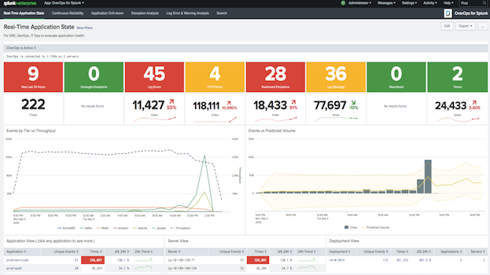

# OverOps for Splunk Application

OverOps can provide net new machine data beyond log files, that will help to enhance and extend your Splunk implementation.  While log files provide some value, OverOps collects unique data at the moment of application execution that gives complete insight into an error or an exception.  And this granular information has proven to be extremely useful inside of Splunk.  See [the OverOps Splunk integration site](https://www.overops.com/splunk) for more information.

With real-time streaming of events & metrics from OverOps directly into Splunk, SREs, DevOps and IT Ops can gain clarity of overall application health as visualized in Splunk Metric Dashboards through key performance indicators, such as the number of unique uncaught and swallowed exceptions, and errors that are new or have resurfaced.  You can’t find those in log files, but now you can with OverOps data inside of Splunk!
#### Real-Time Application State


## Installation procedure for the Splunk app:

###### The OverOps for Splunk application is compatible with OverOps v4.17 and higher. Use of any previous versions may omit some tokens and require modication to the Splunk application. Nonetheless, use of this application will provide a good head start into gaining value from the data of OverOps into Splunk.

###### The OverOps for Splunk application is compatible with following versions of Splunk Enterprise: 6.2.0, 6.2.1, 6.2.2, 6.2.3, 6.2.4, 6.2.5, 6.2.6, 6.2.7, 6.2.8, 6.2.9, 6.2.10, 6.2.11, 6.2.12, 6.2.13, 6.2.14, 6.3.0, 6.3.1, 6.3.2, 6.3.3, 6.3.4, 6.3.5, 6.3.6, 6.3.7, 6.3.8, 6.3.9, 6.3.10, 6.3.11, 6.3.12, 6.3.13, 6.4.0, 6.4.1, 6.4.2, 6.4.3, 6.4.4, 6.4.5, 6.4.6, 6.4.7, 6.4.8, 6.4.9, 6.4.10, 6.5.0, 6.5.1, 6.5.1612 (Splunk Cloud only), 6.5.2, 6.5.3, 6.5.4, 6.5.5, 6.5.6, 6.5.7, 6.5.8, 6.5.9, 6.6.0, 6.6.1, 6.6.2, 6.6.3, 6.6.4, 6.6.5, 6.6.6, 6.6.7, 6.6.8, 6.6.9, 7.0.0, 7.0.1, 7.0.2, 7.0.3, 7.0.4, 7.0.5, 7.1.0, 7.1.1, 7.1.2

### Perform these tasks from within the OverOps user interface:

1. Turn statsd on from publish metrics. (Settings -> Publish Metrics)

2. Define the statsD server address as `<splunk-server-name-here>:8125`
(this reflects a Splunk UDP data input on port 8125)

3. The OverOps metrics should be defined as the following:

```
overops_views,${viewname},${serviceid},${application},${server},${deployment}

overops_events,${serviceid},${application},${server},${deployment},${class},${method},${eventlink},${eventid},${labels},${eventtype},${eventname},${introducedby},${entrypointclass},${entrypointmethod},${firstseen},${infra},${jiraissuekey}

overops_entrypoints,${serviceid},${application},${server},${deployment},${entrypointclass},${entrypointmetrics}

overops_jvms,${serviceid},${application},${server},${applicationpid}

overops_custom,${serviceid}.${application}.${server}.${deployment},${metric},${code}
```


### Perform these tasks from within Splunk:

**Note this app creates a new events index within Splunk called _overops_. A new UDP data input is also created in Splunk on port 8125, _[udp://8125]_.**


1. Save the Splunk overops app locally ( overops.spl )

2. From the Splunk web application, go to Apps -> Manage Apps -> Install App from file, and choose the overops.spl file.

3. Now in Splunk, you should see OverOps for Splunk app ( Apps -> OverOps for Splunk )

4. Drill-down to OverOps Root Cause Analysis: Drill-through links to the OverOps root cause analysis will need to be updated with administration access. The dashboards are Application Drill-down, Application Drill-down-drillthrough and Continuous Reliability. In each of these dashboards, there is a table visualization. 
Edit dashboards -> More details -> Edit Drilldown -> Link to custom URL

`https://app.overops.com/tinykey/$row.RootCause|n$` or `https://<on-prem-overops-server-here>/tinykey/$row.RootCause|n$`

Please be aware that some visuals in the Real-Time Application State dashboard will take a couple days to populate as there are some day over day comparisons, hence the index will need to be filled with the appropriate data.

### More sample screenshots below:

#### Continuous Reliability
For SREs and QA Engineers, identify what builds and deployments have introduced new errors into your code, so you can make informed decisions on when to promote code from environment to environment.


#### Application Drill-down
For the VP of Engineering and Development Leads in your organization, access OverOps data inside Splunk to aggregate specific code locations where errors and exceptions are most prevalent in your code base, and correlate error volumes to application throughput for error rate analysis.


#### Exception Analysis / Log Error & Warning Analysis


#### Event Details
Help Development Leads cut through the noise as OverOps can deduplicate billions of logged events into accurate analytics inside Splunk, without the need to parse and search through text.


